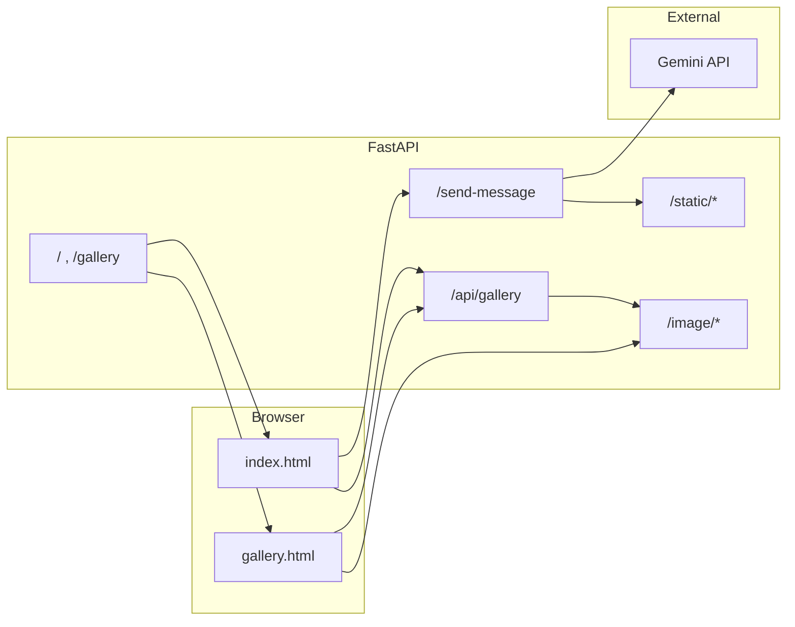

# MEME MIND AI 

Full-stack meme studio: a **FastAPI** backend serves static marketing pages and JSON APIs, while **vanilla HTML/CSS/JavaScript** frontends call those APIs on the same origin. Caption text is produced with **Google Gemini**; rendered meme images are composed with **Pillow** and written to disk.

---

## Table of contents

1. [Overview](#overview)
2. [Architecture](#architecture)
3. [Repository layout](#repository-layout)
4. [Prerequisites](#prerequisites)
5. [Configuration](#configuration)
6. [Installation](#installation)
7. [Running the application](#running-the-application)
8. [HTTP API reference](#http-api-reference)
9. [Frontend behavior](#frontend-behavior)
10. [Operational notes](#operational-notes)
11. [Troubleshooting](#troubleshooting)
12. [Security and production](#security-and-production)

---

## Overview

| Layer | Technology | Role |
|--------|------------|------|
| Backend | FastAPI, Uvicorn | Routes, CORS, static mounts, Gemini caption pipeline, PNG generation |
| AI | `google-generativeai` (pinned) | Short meme captions with model fallbacks |
| Imaging | Pillow | Blank canvas + outlined caption text |
| Frontend | `index.html`, `gallery.html` | Landing experience, meme modal, gallery grid with sort/pagination |
| Config | `python-dotenv` | Loads `Backend/.env` at startup |

The server is intended to be opened at a single base URL (for example `http://127.0.0.1:8000`). The homepage and gallery are plain files served through FastAPI so `fetch('/send-message')` and `fetch('/api/gallery?...')` stay **same-origin** without a separate dev proxy.

---

## Architecture



- **Caption path:** JSON body → Gemini (ordered model list) → string caption → Pillow image → `Backend/static/meme_*.png` → JSON response with `/static/...` URL.
- **Gallery path:** Filenames under `interface/image/` → sorted or shuffled per `sort` → paginated JSON with `/image/...` URLs.

---

## Repository layout

The workspace root holds this README; the runnable site lives under **`interface/`**.

```
.
├── README.md
└── interface/
    ├── index.html              # Main landing page + meme generator UI
    ├── gallery.html            # Gallery grid, filters, lightbox
    ├── image/                  # Source images for /image and /api/gallery
    ├── web/                    # Next.js app (Vercel-ready; see web/README.md)
    └── Backend/
        ├── main.py             # Application entrypoint and routes
        ├── requirements.txt    # Pinned Python dependencies
        ├── .env.example        # Template for environment variables
        ├── .env                # Local secrets (create yourself; do not commit)
        ├── run.bat             # Windows helper: checks .env, runs Uvicorn with venv
        ├── static/             # Generated meme PNGs (created at runtime)
        ├── templates/
        │   └── login.html      # Login/sign-up shell (POST redirects to /)
        └── venv/               # Optional local virtualenv (gitignored typical)
```

Commands that reference **`interface/Backend`** use the inner `interface` folder (the sibling of `index.html`).

### Next.js on Vercel

The folder **`interface/web`** is a **Vercel-ready Next.js 15** app: it serves the shader hero plus **`/api/send-message`**, **`/api/demo-meme`**, **`/api/gallery`**, and pages **`/create`**, **`/gallery`**, **`/login`**. Set the Vercel project **Root Directory** to `interface/web`, add **`GEMINI_API_KEY`** in project settings, and deploy. Full steps and env vars are in **`interface/web/README.md`**.

---

## Prerequisites

- **Python** 3.10 or newer (3.11+ recommended).
- **Google AI Studio API key** for Gemini: [https://aistudio.google.com/apikey](https://aistudio.google.com/apikey)
- **Network** access from the machine running the backend to Google’s generative AI endpoints.
- **Fonts (optional but recommended):** caption rendering tries Windows Arial Bold or common Linux font paths; if none match, Pillow’s default bitmap font is used (smaller, less polished).

---

## Configuration

### Environment variables

Create `interface/Backend/.env` by copying `interface/Backend/.env.example`:

| Variable | Required | Description |
|----------|----------|-------------|
| `GEMINI_API_KEY` | Yes, for captions | API key from Google AI Studio. If empty, `/health` reports `gemini_configured: false` and `/send-message` returns a structured error without calling remote models. |

Example:

```env
GEMINI_API_KEY=your_key_here
```

**Never commit** `.env` or real keys to version control.

---

## Installation

All commands below assume your shell’s working directory is **`interface/Backend`**.

### 1. Virtual environment

```bash
python -m venv venv
```

Windows activation:

```powershell
.\venv\Scripts\Activate.ps1
```

macOS / Linux:

```bash
source venv/bin/activate
```

### 2. Dependencies

```bash
pip install -r requirements.txt
```

Key packages (see `requirements.txt` for exact versions):

- `fastapi`, `uvicorn`, `python-multipart`
- `google-generativeai` (pinned for stable caption behavior)
- `pillow`, `python-dotenv`, `jinja2`
- `python-jose`, `passlib` (available for auth evolution; current login flow is minimal)

---

## Running the application

### Full project (recommended local setup)

Run both servers in parallel so you can access the complete project:

1. **Backend (FastAPI + classic HTML pages)** from `interface/Backend`:

```bash
python -m uvicorn main:app --host 127.0.0.1 --port 8000
```

2. **Frontend (Next.js app)** from `interface/web`:

```bash
npm run dev
```

Use these URLs:

- **Classic full app (FastAPI + `index.html` / `gallery.html`):** [http://127.0.0.1:8000](http://127.0.0.1:8000)
- **Next.js app:** [http://localhost:3000](http://localhost:3000) with pages `/create`, `/gallery`, `/login`

If you only open `http://localhost:3000`, you are viewing the Next.js homepage route, not the older classic HTML homepage.

### Backend-only mode

From **`interface/Backend`** with the virtual environment activated:

```bash
python -m uvicorn main:app --host 127.0.0.1 --port 8000
```

Then open **[http://127.0.0.1:8000](http://127.0.0.1:8000)** in a browser.

### Windows: `run.bat`

`Backend/run.bat` expects:

- A file named **`Backend/.env`** with `GEMINI_API_KEY` set.
- A virtual environment at **`Backend/venv`** (it invokes `venv\Scripts\python.exe`).

Double-click or run from `Backend`:

```bat
run.bat
```

If `.env` is missing, the script prints instructions and exits.

### Smoke check

```http
GET http://127.0.0.1:8000/health
```

Example JSON:

```json
{"status":"ok","gemini_configured":true}
```

---

## HTTP API reference

### `GET /health`

Liveness and configuration snapshot.

| Field | Type | Meaning |
|-------|------|---------|
| `status` | string | `"ok"` when the process is serving |
| `gemini_configured` | boolean | `true` if `GEMINI_API_KEY` was non-empty at startup |

---

### `GET /api/demo-meme`

Returns a **PNG** built with Pillow only (no Gemini). Used by the homepage modal for **offline/showcase** when the browser fetches this route, and as a reliable fallback when client-side canvas or SVG previews fail.

| Query | Meaning |
|-------|---------|
| `q` | Optional user idea text (truncated server-side). |

Response: `200` with `Content-Type: image/png`.

---

### `POST /send-message`

Generates a short meme **caption** with Gemini, renders it onto a **PNG**, saves under `Backend/static/`, and returns URLs relative to the server root.

**Request** — `Content-Type: application/json`

```json
{
  "message": "A cat judging my code review"
}
```

**Success response** — `200`, JSON:

| Field | Type | Description |
|-------|------|-------------|
| `status` | string | `"success"` |
| `caption` | string | Plain text caption used on the image |
| `image_url` | string | Path such as `/static/meme_<hash>.png` |

**Error response** — `200` with `status: "error"` and a human-readable `message`, or `503` if the server was started without a configured API key.

The backend tries an ordered list of Gemini model names and safely extracts text when the SDK returns blocked or empty payloads. Clients should treat any `status !== "success"` as a failure and surface `message` to the user.

---

### `GET /api/gallery`

Paginated metadata for images stored in **`interface/image/`**.

**Query parameters**

| Name | Type | Default | Description |
|------|------|---------|-------------|
| `page` | integer | `1` | 1-based page index |
| `per_page` | integer | `12` | Clamped to `1`–`48` |
| `sort` | string | `all` | `all`, `latest`, `trending`, or `popular` |

**Sort semantics**

- `all` — alphabetical by filename (case-insensitive).
- `latest` — reverse alphabetical (treat as “newest name” convention).
- `trending` — shuffled with a seed that changes hourly.
- `popular` — shuffled with a seed that changes daily.

**Response** — JSON:

| Field | Type | Description |
|-------|------|-------------|
| `items` | array | Objects with `url`, `title`, `description` |
| `total` | integer | Total matching files |
| `page` | integer | Current page |
| `per_page` | integer | Page size |
| `sort` | string | Echo of applied sort mode |

Each `url` is of the form `/image/<filename>` (URL-encoded when necessary).

---

### HTML and static routes

| Route | Description |
|-------|-------------|
| `GET /` | Serves `interface/index.html` |
| `GET /gallery`, `GET /gallery.html` | Serves `interface/gallery.html` |
| `GET /login` | Renders `templates/login.html` |
| `POST /login` | Accepts form fields; responds with `303` redirect to `/` (placeholder integration) |
| `GET /image/*` | Static files from `interface/image/` |
| `GET /static/*` | Static files from `Backend/static/` (generated memes) |

---

## Frontend behavior

- **`index.html`** — Marketing sections, navigation, and a meme generator that `POST`s to `/send-message`. Success UI should wait until the returned image resource has actually loaded when displaying “ready” states.
- **`gallery.html`** — Fetches `/api/gallery` with `page`, `per_page`, and `sort`, renders skeletons while loading, and uses modal/lightbox patterns with accessibility considerations (focus, ARIA).

Both pages assume the **API base URL is the same origin** as the document (no hardcoded port in production if you reverse-proxy correctly).

---

## Operational notes

- **Gallery file list cache:** The list of filenames under `image/` is cached in memory after the first read. Adding or removing files may require a **process restart** to refresh the cache in the current implementation.
- **Generated assets:** Memes accumulate in `Backend/static/`. Plan disk retention or periodic cleanup for long-running deployments.
- **CORS:** `CORSMiddleware` is configured with `allow_origins=["*"]`, which is convenient for local development and permissive hosting; tighten for production if the API is exposed separately from static pages.

---

## Troubleshooting

| Symptom | Likely cause | What to do |
|---------|----------------|------------|
| `gemini_configured: false` in `/health` | Missing or empty `GEMINI_API_KEY` | Add key to `Backend/.env`, restart Uvicorn |
| Caption errors or empty captions | Invalid key, quota, model access, or safety block | Verify key in AI Studio, check server logs for model name and block reason; rephrase prompt |
| `run.bat` exits immediately | No `.env` or wrong working directory | Copy `.env.example` to `.env`; run from `Backend` |
| `run.bat` cannot find Python | No `venv` at `Backend/venv` | Create venv as documented and `pip install -r requirements.txt` |
| Gallery empty | No supported images in `interface/image/` | Add `.jpg`, `.jpeg`, `.png`, `.gif`, `.webp`, or `.bmp` files |
| Old memes still listed after file delete | In-memory gallery cache | Restart the server |

---

## Security and production

- Treat **`GEMINI_API_KEY`** as a secret: restrict file permissions, use a secrets manager in cloud deployments, and rotate if leaked.
- **Do not** expose admin-style endpoints without authentication if you extend this project.
- For production, run behind a reverse proxy (HTTPS), set sensible **rate limits** on `/send-message`, and consider restricting **CORS** and file upload sizes if you add uploads later.
- The `google.generativeai` package may emit deprecation notices; upgrading to newer Google GenAI SDKs should be planned as a tracked migration, not an emergency copy-paste.

---

## License

No license file is implied by this README. Add a `LICENSE` file at the repository root when you decide how this project may be redistributed.
